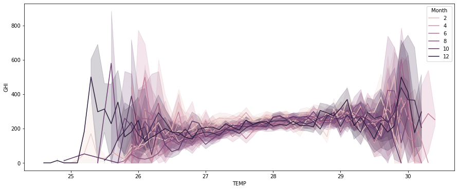
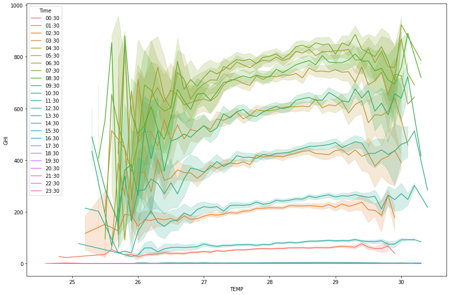
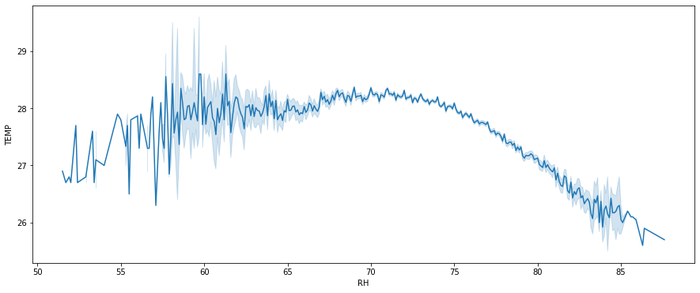

### Capstone-project-III

# Solar measurements in the maldieves.
In this really fun project I explored the temperature data from the maldieves
based on the irridation (Wh/m2) watt per square metre. This irridiation affects measures values like:
    - TEMP - Air temperature at 2 m [deg. C]  
    - WS - Wind speed at 10 m [m/s]  
    - WD - Wind direction at 10 m [deg.]  
    - RH - Relative humidity [%]  
    - AP - Atmospheric pressure [hPa]  
    - PWAT - Precipitable water [kg/m2]

which are some of the present values measured for this dataset. The values were measured over a whole day for every day for 17 years. The intervals are over an hour each day. The average effect of global irridiation on temperature over the are of Malé area in the maldieves is described the graph below seperated over months of the year.

 The average effect of global irridiation on temperature over the are of Malé area in the maldieves is described the graph below seperated over the time of day.

There are other factors that attribute to temperature reading in the area of male. Like the relative humiditiy which is shown in the graph below. It shows a rather normal oscillationg graph that describe the fact that as the humidity grows so does the temperature until a certain threshold is met on totoal humidity and then the temperature sinks as if the weather regulates the amount of water that is in the air... perhaps through precipitation.

These are some of the facts that are explored in the report. 
